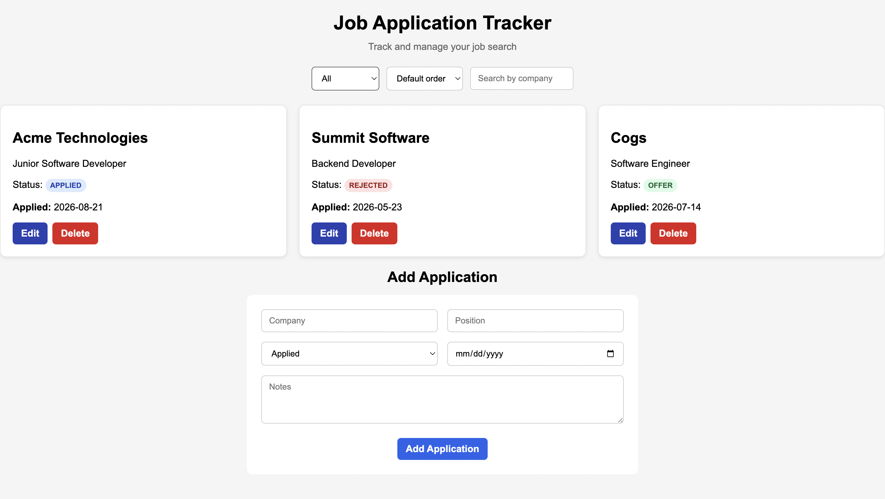

# Job Application Tracker

A full-stack web application for tracking and managing job applications. Users can add, edit, delete, filter, and sort applications through a React frontend backed by a Spring Boot REST API and PostgreSQL database.

## Features

- Create, view, edit, and delete job applications
- Track company, position, application date, status, and notes
- Filter applications by company and status
- Sort applications by application date
- Persistent PostgreSQL storage
- RESTful API built with Spring Boot
- Automated integration tests for API functionality
- Responsive React interface

## Tech Stack

### Backend
- Java 17
- Spring Boot
- Spring Data JPA / Hibernate
- PostgreSQL
- Maven

### Frontend
- React
- JavaScript
- Vite
- CSS

### Testing
- JUnit
- Spring MockMvc
- H2 in-memory database

### DevOps
- Docker
- Docker Compose

## Screenshot



## Running with Docker

### Prerequisites

- Docker Desktop

### Setup

Create a `.env` file in the project root based on `.env.example`:

```env
DB_PASSWORD=your_database_password
```

Start the application:

```bash
docker compose up --build
```

Once all services are running:

- Frontend: `http://127.0.0.1:5173`
- Backend API: `http://127.0.0.1:8080/applications`
- PostgreSQL: `localhost:5433`

To stop the application:

```bash
docker compose down
```

Application data is stored in a persistent Docker volume, so recreating the containers does not delete the PostgreSQL database.

## Running Locally Without Docker

## Running Locally

### Prerequisites

Make sure you have installed:

- Java 17+
- Node.js and npm
- PostgreSQL

### Database Setup

Create a PostgreSQL database named:

```text
jobtracker
```

The application expects the database password through the `DB_PASSWORD` environment variable.

On macOS/Linux:

```bash
export DB_PASSWORD="your_database_password"
```

### Run the Backend

From the project root:

```bash
./mvnw spring-boot:run
```

The API will run at `http://localhost:8080`.

### Run the Frontend

In another terminal:

```bash
cd frontend
npm install
npm run dev
```

The frontend will run at `http://127.0.0.1:5173`.

## API Endpoints

| Method | Endpoint | Description |
| --- | --- | --- |
| GET | `/applications` | Get all applications |
| GET | `/applications/{id}` | Get an application by ID |
| POST | `/applications` | Create an application |
| PUT | `/applications/{id}` | Update an application |
| DELETE | `/applications/{id}` | Delete an application |

`GET /applications` also supports filtering by company/status and sorting by application date.

## Future Improvements

- Deploy the containerized application
- Add user authentication
- Add dashboard statistics and application summaries
- Add CI/CD with GitHub Actions

## Author

Chayse Caltland